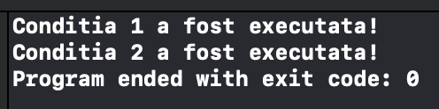

## 1 si 0 / adevarat si fals

Calculatorul lucreaza in numere binare, adica *1* si *0*, nu o sa explic extrem de detaliat ce fac ele deoarece nu avem nevoie sa le folosim avansat inca, tot ce trebuie sa tineti minte e urmatorul concept:


Dupa cum vedeti in imagine, **1** reprezinta beculetele *aprinse* si **0** beculetele *stinse*.
Deci, daca urmam aceasta logica, putem spune ca: 
<br>__1 = true(adevarat)__ si __0 = false(fals)__.

**Conditiile / ciclurile** lucreaza dupa aceeasi baza dar o modifica un pic, intr-un limbaj de programare, conditia este adevarata daca numarul este diferit de 0 ( mai mare sau mai mic ) si falsa daca numarul este 0:
- 1 = true(adevarat)
- 15231223 = true(adevarat)
- -1241 = true(adevarat)
- 0 = false(fals).

Pentru a intelege mai bine cum functioneaza conditia, incercati sa va inchipuiti un intrerupator de lumina, daca setam intrerupatorul pe ON, el va permite curentului eletric sa treaca si sa aprinda becul iar daca il setam pe OFF, acesta nu va continua, ci, spre exemplu, va transmite electricitatea urmatorului intrerupator.


---

## Conditii in C

>In __C__ o conditie simpla arata astfel:
```c
if( conditie ){
    //cod
}
```
```c
if( conditie )
    //cod;
```
>Ambele metode sunt corecte, folosim prima metoda daca avem mai multe linii de cod si a doua metoda daca avem o singura linie de cod, prima foloseste acolade iar a doua " ; "

Daca incercam sa intelegem conditia dupa cele explicate mai sus, ne dam seama ca aceasta conditie va executa codul doar in cazul in care conditia este diferita de zero, deci if-ul verifica valoarea din interiorul parantezelor rotunde.

```c
if( 1 ){
    printf("Conditia 1 a fost executata!\n");
}

if( -125123 )
    printf("Conditia 2 a fost executata!\n");

if( 0 ) printf("Conditia 3 a fost executata!\n");
```
> Toate trei tipuri de a scrie conditia sunt corecte dar cel mai bine e sa le utilizati pe primele doua



Toate conditiile inafara de conditia care ia valoarea 0 sunt executate

---

## Expresii in conditie

Pe langa faptul ca putem da constante ( constantele sunt numerele hard-codate, aka nu sunt variabile ), putem oferi si diferite expresii conditiilor:
- Putem oferi direct variabile, conditia va verifica daca variabila este diferita de zero, in cazul in care ea este diferita de zero se va executa codul.
- Putem compara doua variable, constante cu ajutorul urmatorilor operatori:
    - **==** 
        - element_1 == element_2 ||| *(returneaza 1 daca elementele sunt egale, altfel 0)*
        - !!!OPERATORUL DE COMPARATIE ESTE " == ". " = " ESTE OPERATOR DE ATRIBUIRE
    - **!=** 
        - element_1 != element_2 ||| *(returneaza 1 daca elementele nu sunt egale, altfel 0)*
    - **>**  
        - element_1 > element_2  ||| *(returneaza 1 daca elementul 1 este mai mare, altfel 0)*
    - **<**  
        - element_1 < element_2  ||| *(returneaza 1 daca elementul 1 este mai mic, altfel 0)*
    - **>=** 
        - element_1 >= element_2 ||| *(returneaza 1 daca elementul 1 este mai mare sau egal, altfel 0)*
    - **<=** 
        - element_1 == element_2 ||| *(returneaza 1 daca elementul 1 este mai mic sau egal, altfel 0)*

---

## Vizibilitatea functiei

Pentru a intelege cum lucreaza vizibilitatea corpului unei conditii, si nu doar a conditiei dar si a ciclurilor / functiilor etc, incercati sa ganditi in urmatorul mod:
La inceput am spus ca un calculator lucreaza in 1 si 0 si v-am prezentat exemplul cu un intrerupator de lumina, inchipuitiva ca acel intrerupator controleaza lumina pentru intreaga camera, deci, daca el e stins, nu puteti aprinde calculatorul, televizorul, lumina sau alte dispozitive electrice in camera, ganditiva ca acele dispozitive nu exista, ele apar doar atunci cand le oferiti electricitate.
<br>Aproximativ la fel lucreaza si programul, conditia, if in acest caz, verifica ceea ce se afla intre parantezele rotunde, daca gaseste 0, nu executa nimic din blocul sau (blocul e ceea ce se afla intre acolade sau ceea ce e pana la " ; " ), daca gaseste alt numar decat 0 incepe executia sau *aprinde intrerupatorul*.

```c
	if (1) 
	{
		printf("ok");
	}
```
```c
	if (1){
		printf("ok");
	}
```
```c
	if (1) printf("ok");
```

Toate trei sunt blocuri de cod. Aceste linii de cod pot fi scrise si asa:

```c
	if (1) 
	
	
	{
		printf("ok");


	}
```
```c
	if (1){printf("ok");}
```
```c
	if (1)			
				
		
					printf("ok");
```

Atat timp cat le scriem corect una dupa alta si respectam una din ordini:
<br> - __if, paranteze rotunde, acolada deschisa, cod, acolada inchisa__ 
<br>sau 
<br> - __if, paranteze rotunde, cod, punct si virgula__
<br>nu conteaza la ce distanta le punem una de alta sau pe ce linie, putem avea 100 de linii goale intre ele, compilatorul va sti ca se incepe de la " { " si se termina la " }" , dar va fi mai greu de vizualizat / inteles codul de aceea e bine sa le scrieti mereu dupa un template care este aratat la inceputul sectiei.


Deci, puteti vedea ca un bloc de cod poate incepe si termina cu " { } ", in cazul nostru aceste acolade arata camera voastra, tot ce se afla intre ele e ceea ce aveti voi in camera. 
<br>Va amintitit ca tot ce aveti in camera ( calculatorul etc ) lucreaza doar in cazul in care intrerupatorul de lumina este aprins? Pai exact si elementele acestui bloc de cod sau mai bine zis, codul din acest bloc. 

<br> ***!!! TOATE ELEMENTELE DIN BLOC EXISTA DOAR ATAT TIMP CAT EXISTA BLOCUL, DACA TERMINATI BLOCUL CU } SAU ; ELEMENTELE SE STERG DIN MEMORIE !!!***

Deci, daca stingem intrerupatorul, in cazul nostru el se stinge automat cand ajunge la " } ", tot ceea ce ati avut in camera nu mai poate fi utilizat. In viata reala ele vor ramane in camera dar intr-un calculator ele sunt sterse din memoria temporara sau mai bine zis RAM pentru a nu ocupa spatiu degeaba (Nu avem ram infinit).
<!--
https://docs.github.com/en/github/writing-on-github/getting-started-with-writing-and-formatting-on-github/basic-writing-and-formatting-syntax

https://docs.microsoft.com/en-us/azure/devops/project/wiki/markdown-guidance?view=azure-devops#:~:text=a%20new%20paragraph.-,In%20a%20Markdown%20file%20or%20widget%2C%20enter%20two%20spaces%20before,action%20begins%20a%20new%20paragraph.
-->